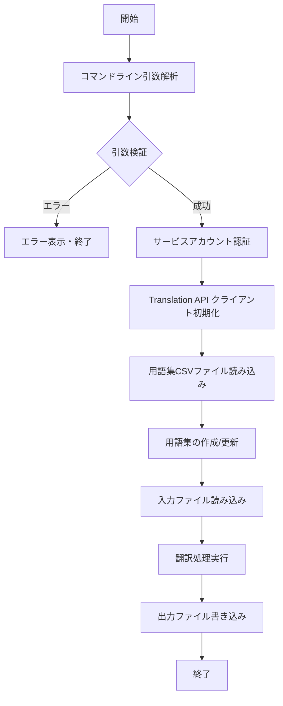
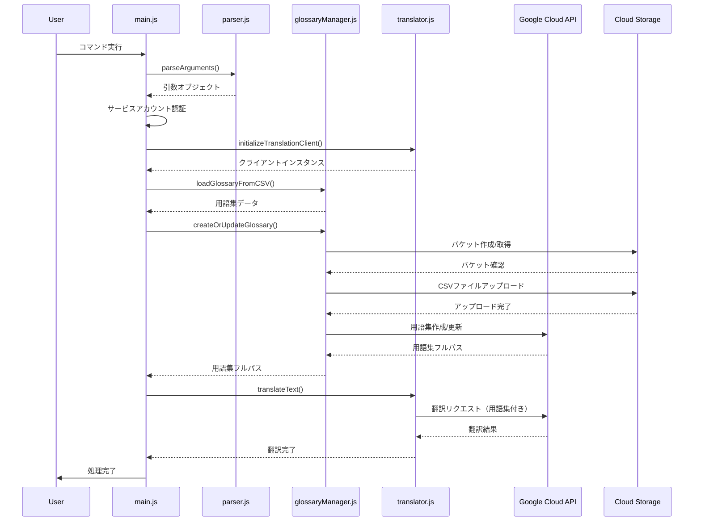

# 処理フロー設計書

## 1. メイン処理フロー



## 2. 詳細処理フロー

### 2.1 初期化フェーズ

```
1. コマンドライン引数の解析
   - yargsによる引数パース
   - 必須引数の存在確認
   
2. 引数の妥当性検証
   - 入力ファイルの存在確認
   - サービスアカウントキーファイルの存在確認
   - 用語集CSVファイルの存在確認
   - 言語コードの形式確認（ISO 639-1）
   
3. Google Cloud認証
   - サービスアカウントキーの読み込み
   - Translation APIクライアントの初期化
   - プロジェクトIDの設定
```

### 2.2 用語集準備フェーズ

```
1. CSVファイルの解析
   - ヘッダー行から言語コードを取得
   - データ行から用語エントリを取得
   - データ構造への変換
   
2. Cloud Storageの準備
   - プロジェクト専用バケットの作成または取得
   - バケット名: {projectId}-translation-glossary
   
3. 用語集データのアップロード
   - CSVデータをCloud Storageにアップロード
   - ファイル名: translation-glossary.csv
   - Content-Type: text/csv
   
4. 用語集リソースの管理
   - 既存の用語集（translation-glossary）の存在確認（us-central1）
   - 存在する場合：削除して再作成
   - 存在しない場合：新規作成
   
5. 用語集の登録
   - Translation API用語集リソースの作成
   - 等価用語セット（languageCodesSet）形式で登録
   - 用語集フルパスの取得
```

### 2.3 翻訳実行フェーズ

```
1. 入力ファイルの読み込み
   - UTF-8エンコーディングでファイル全体を読み込み
   
2. 翻訳APIの呼び出し
   - 用語集IDを指定して翻訳リクエスト
   - 翻訳元言語・翻訳先言語の指定
   - レスポンスの受信
   
3. 出力ファイルへの書き込み
   - UTF-8エンコーディングで翻訳結果を保存
   - 既存ファイルは上書き
```

## 3. エラー処理フロー

### 3.1 引数エラー

```
引数エラー検出
├── 必須引数の不足
│   └── エラーメッセージ表示 → 終了（exit code: 1）
├── ファイルが存在しない
│   └── エラーメッセージ表示 → 終了（exit code: 1）
└── 不正な言語コード
    └── エラーメッセージ表示 → 終了（exit code: 1）
```

### 3.2 API エラー

```
APIエラー発生
├── 認証エラー
│   └── "認証に失敗しました" → 終了（exit code: 2）
├── 用語集作成エラー
│   ├── "Empty resource name" → リソース名の形式エラー
│   ├── "Invalid CSV format" → 等価用語セット形式エラー
│   └── "用語集の作成に失敗しました" → 終了（exit code: 3）
├── Storage エラー
│   ├── "Bucket creation failed" → バケット作成権限エラー
│   └── "File upload failed" → ファイルアップロードエラー
└── 翻訳エラー
    └── "翻訳処理に失敗しました" → 終了（exit code: 4）
```

## 4. シーケンス図



## 5. データフロー

```
入力データ:
- コマンドライン引数
- サービスアカウントキー（JSON）
- 用語集（CSV）
- 入力テキスト（TXT）

↓ 処理

中間データ:
- 認証トークン
- 用語集ID
- 翻訳リクエスト

↓ API呼び出し

出力データ:
- 翻訳済みテキスト（TXT）
```

## 6. 状態遷移

```
[初期状態]
    ↓
[引数解析中]
    ↓ 成功
[認証中]
    ↓ 成功
[用語集準備中]
    ↓ 成功
[翻訳処理中]
    ↓ 成功
[完了]

※ 各状態でエラーが発生した場合は [エラー終了] 状態へ遷移
```